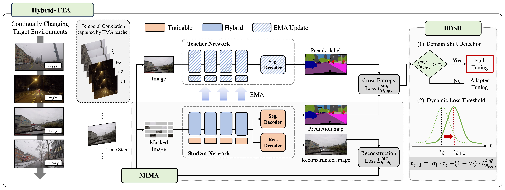
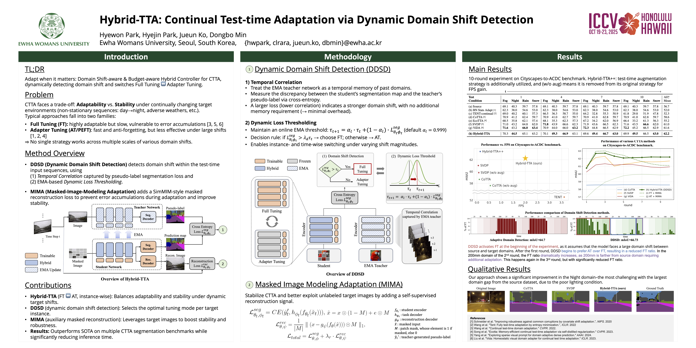

# ⛵Hybrid-TTA: Continual Test-time Adaptation via Dynamic Domain Shift Detection [ICCV 2025]

[](https://sites.google.com/view/hybrid-tta/home)  [](https://arxiv.org/abs/2409.08566v2)

[Hyewon Park](https://github.com/hhhyyeee)<sup>1</sup>, [Hyejin Park](https://github.com/kunsaram01)<sup>1</sup>, [Jueun Ko](https://github.com/0ju-un)<sup>1</sup>, Dongbo Min<sup>1</sup>

<sup>1</sup> Ewha W. University

Official source code for [**Hybrid-TTA: Continual Test-time Adaptation via Dynamic Domain Shift Detection**](https://arxiv.org/abs/2409.08566v2), **ICCV 2025**.

<!-- 🚨 **Source code of Hybrid-TTA will be updated soon.** -->


## 🔔 News:
* [2025-10-28]: Source code is released.
* [2025-06-26]: We are happy to announce that **Hybrid-TTA** was accepted at [ICCV 2025](https://openaccess.thecvf.com/content/ICCV2025/html/Park_Hybrid-TTA_Continual_Test-time_Adaptation_via_Dynamic_Domain_Shift_Detection_ICCV_2025_paper.html).


## Abstract

Continual Test Time Adaptation (CTTA) has emerged as a critical approach to bridge the domain gap between controlled training environments and real-world scenarios. Since it is important to balance the trade-off between adaptation and stabilization, many studies have tried to accomplish it by either introducing a regulation to fully trainable models or updating a limited portion of the models. This paper proposes **Hybrid-TTA**, a holistic approach that dynamically selects the instance-wise tuning method for optimal adaptation. Our approach introduces **Dynamic Domain Shift Detection (DDSD)**, which identifies domain shifts by leveraging temporal correlations in input sequences, and dynamically switches between Full or Efficient Tuning for effective adaptation toward varying domain shifts. To maintain model stability, **Masked Image Modeling Adaptation (MIMA)** leverages auxiliary reconstruction task for enhanced generalization and robustness with minimal computational overhead. Hybrid-TTA achieves *0.6%p* gain on the Cityscapes-to-ACDC benchmark dataset for semantic segmentation, surpassing previous state-of-the-art methods. It also delivers about 20-fold increase in FPS compared to the recently proposed fastest methods, offering a robust solution for real-world continual adaptation challenges.

<!--  -->



## Prerequisite

### 1) Setup Datasets
We refer to [MMSegmentation](https://github.com/open-mmlab/mmsegmentation) for further instructions about the dataset structure.

- **Cityscapes:**
    Please download `leftImg8bit_trainvaltest.zip` and `gt_trainvaltest.zip` from [here](https://www.cityscapes-dataset.com/downloads/) and extract them to `{DATA_DIR}/cityscapes`.

    Prepare the source dataset:
    ```shell
    python tools/convert_datasets/cityscapes.py {DATA_DIR}/cityscapes --out-dir data/cityscapes --nproc 8
    ```

- **ACDC:**
    Please download `rgb_anon_trainvaltest.zip` and `gt_trainval.zip` from [here](https://acdc.vision.ee.ethz.ch/download) and extract them to `{DATA_DIR}/ACDC`.

### 2) Download Checkpoints

Please download Cityscapes pre-trained weights from [SegFormer GitHub](https://github.com/NVlabs/SegFormer?tab=readme-ov-file#evaluation), and save them in `./weights/` directory.


### 3) Setup Environment

```
conda create -n hybrid-tta python=3.8

pip install torch==1.9.1+cu111 torchvision==0.10.1+cu111 torchaudio==0.9.1 -f https://download.pytorch.org/whl/torch_stable.html

pip install -U openmim

mim install mmcv-full==1.7.2

pip install mmengine==0.10.4 timm==0.4.12 kornia==0.7.2

pip install -r requirements.txt
```

### 4) Preparations

- Put project path in `sys.path.append("{PROJECT_DIR}")` on `scripts/ours.py`

- Put data path (`{DATA_DIR}`) in dataset configuration file
    - `./local_configs/_base_/datasets/acdc_960x540_repeat.new.py`


- Create `./tmp/` directory
    ```
    mkdir ./tmp
    ```

## Execution
```
python scripts/ours.py local_configs/segformer/B5/segformer.b5.960x540.acdc.160k.new.py weights/segformer.b5.1024x1024.city.160k.pth --wandb 0
```

## Citation
Consider citing us if you find our paper useful in your research. 🥰
```
@InProceedings{Park_2025_ICCV,
    author    = {Park, Hyewon and Park, Hyejin and Ko, Jueun and Min, Dongbo},
    title     = {Hybrid-TTA: Continual Test-time Adaptation via Dynamic Domain Shift Detection},
    booktitle = {Proceedings of the IEEE/CVF International Conference on Computer Vision (ICCV)},
    month     = {October},
    year      = {2025},
    pages     = {2877-2886}
}
```


## Acknowledgements

This project is based on the following open-source projects.

* [MMSegmentation](https://github.com/open-mmlab/mmsegmentation)
* [SegFormer](https://github.com/NVlabs/SegFormer)
* [CoTTA](https://github.com/qinenergy/cotta?tab=readme-ov-file#segmentation-experiments)
